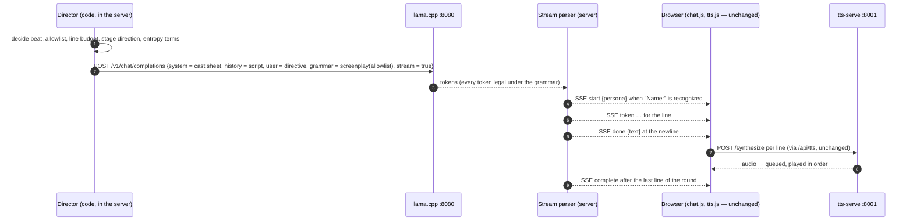

# Prompt structure — what one LLM request looks like when the show takes a turn

**Date:** 2026-09-21 · **Arc:** MVP prototype · **Branch:**
`alfre2v/task6-recon-brief`
**Type:** design discussion (the first of the two decisions pulled
into this arc by the owner's 2026-09-21 ruling — see TODO.md's
boundary note; the second is the story loop, which follows this
one because the loop's shape depends on who assembles the prompt).
This document is also unit 4 of the Task 6 reconnaissance brief
(`docs/discussions/2026-09-21-task6-reconnaissance-brief.md` §10):
the 2024 design contrasted with the TalkWithMe chassis, with the
door left open to a third structure.
**Status:** **DIRECTION ADOPTED 2026-09-21 (owner: "we move firmly
in pursuit of your lean")** — structure E, one shared context in
screenplay form under a server-enforced grammar (§9). The final
decision is gated on two on-box confirmations and one audition
item (§11); none of them needs the fork to exist.

*Context for the cold reader.* Zombie-Radio is an audio-only
theater play performed live by four LLM personas over a fictional
shortwave radio, with an audience that can talk back. The
prototype runs on TalkWithMe (scorbo2's multi-persona chat app,
tag 7.1) as the client and director, with llama.cpp, tts-serve,
and Whisper as the model services on a rented GPU box. TalkWithMe
was built for chat, not theater; the reconnaissance brief found
that several of the show's observed failures are consequences of
HOW TalkWithMe assembles the prompt it sends to the LLM on every
persona turn. The owner's 2024 prototype (`zombie_radio_ai`)
assembled it differently. This document compares the two, adds
the alternatives neither used, and picks a direction for the fork
(TalkWithZombies). The vocabulary for failure mechanisms (C1, C3,
E1, …) is the narrative-health taxonomy of
[discussion 2026-09-16] storytelling-coherence-and-structure-adherence;
its two axes are *structure adherence* (obeying the declared
format, identity, arc) and *storytelling coherence* (the story
hanging together).

*Path conventions:* files in the sibling clones are given with
full absolute paths; files in this repository relative to its
root. Labels: measured / docs-say / believed.

---

## 0. The question in one sentence

**What does one LLM request look like when the show takes a turn,
who assembles it, and what comes back?** Everything downstream —
the label sanitizer, the sentence accumulator, the director, the
story loop — depends on the answer, which is why the owner ruled
that no source patch is shaped before this is settled.

## 1. What TalkWithMe does today — structure A, per-persona chat

One request per persona line. Receipts in
`/Users/alfredo/workspace/hackTNT_2026/TalkWithMe/`:

- The system prompt for a reply is that persona's prompt, then its
  saved memories, then the global system prompt
  (`app/routers/chat.py:297` to 302; assembly helpers at
  `chat.py:140` to 201).
- The history is rewritten FOR THE RESPONDER by
  `SessionManager.build_llm_messages`
  (`app/session.py:146` to 161): the human's lines keep the role
  `user`; the responder's own earlier lines keep `assistant`;
  every OTHER persona's line becomes a `user` message whose text
  is `[Name]: what they said` (line 159). Upstream's own feature
  doc explains why: consecutive `assistant` messages made the LLM
  server return 400, and the rewrite also stops the model treating
  another persona's words as its own
  (`docs/feature_persona_to_persona.md`, addendum).
- A round is one router call (16 tokens, temperature 0.1) to pick
  the first speaker, then up to four persona calls, serial;
  followers are `random.choice` (`chat.py:226`, `chat.py:261`).
- The request carries only `model`, `messages`, `max_tokens`,
  `temperature`, `stream` (`app/services/llm.py:69` to 78).

**Strengths.** Strong per-persona identity from a dedicated system
prompt; a clean one-reply-one-voice mapping onto the TTS pipeline;
upstream's per-persona features (memories, tool calls) — which we
do not use.

**Charged by the taxonomy (field-observed or supported):** C1 and
C3 — labels leak into output and re-seed themselves, because the
model imitates the `[Name]:` format it is shown; C2 — a two-role
chat template wearing a four-actor play, three quarters of the
world arriving as "the user"; C6 — the director is the one voice
with no name; E1 — followers conscripted at random; E3 — nobody
owns the story.

## 2. What the 2024 prototype did — structure B, one shared context in screenplay form

Receipts in
`/Users/alfredo/workspace/hackTNT_2026/zombie_radio_ai/zradio_local/zradio_local.py`
(full read in the brief's umbrella §7):

- ONE conversation for the whole cast (`LargeLanguageModel.chat`,
  line 438). The system prompt is a cast sheet plus the rules; the
  transcript is a script in `Character Name: Dialog Line` form
  (prompt at lines 512–539).
- A hidden Narrator — the `user` role — issues one directive per
  turn naming the speaker and carrying the entropy terms (line
  657); the model answers with one line for one character; a
  parser splits name from line (lines 701–707); a parse failure
  skipped the turn but left the bad reply in context (lines 748
  and 442).
- Owner's recollection (2026-09-21): the narrator "brought the
  narration alive"; repetition was the enemy; characters' lines
  "remained mostly independent, so not bleeding into each other —
  but to be fair, the quality of their lines was poor", and the
  repetition problem consumed the time that strengthening the
  story would have taken.

**Against the taxonomy:** C1, C3, C6 disappear by construction —
labels are the protocol, the director IS the user; C2 disappears —
the roles are the natural ones, director speaks, cast answers; E1
becomes a choice — the narrator names the speaker or lets the
model decide. **What it adds:** C4 (voice homogenization) becomes
the main identity risk, all four characters in one context with a
paragraph each to differ by; B2 (dilution) grows, the cast sheet
is one long system prompt; and parse failures are a new failure
class.

## 3. The candidate structures, as first ranked (round one)

- **A — per-persona chat** (TalkWithMe as is), plus the sanitizer
  and the accumulator as patches. Cheapest; leaves E3 with no
  owner.
- **B — one shared context, one line per call** (2024).
- **C — director plus actors, the hybrid.** Keep A's per-persona
  calls; add a director step before each round (code, or a small
  LLM call like today's router) returning speaker, beat, and a
  stage direction; inject the direction per turn into the
  system-prompt tail through the existing `_with_global_system_prompt`
  seam (`chat.py:183` to 201); the director's in-fiction traffic
  arrives as a named `[Director]:` user message. Gives E3 an
  owner, fixes C6 and C8, replaces E1; KEEPS C2 and the sanitizer.
- **D — one shared context, whole round per call.** B generalized:
  ask the model to write the next exchange, several speakers, in
  script form, parsed line by line as it streams. One prompt
  evaluation and one generation per round instead of five calls;
  turn-taking done by the model — E1 and E2 solved intrinsically,
  a radio net where not every station reports. Risks: one
  character dominating, round length, streaming parse boundaries.
- **E — any of B/C/D with the wire format ENFORCED by the server.**
  llama-server accepts a grammar per request and then cannot emit
  a token outside it. First proposed as a JSON schema (speaker,
  line, emotion, addressee as fields); **revised in round three to
  a screenplay grammar** — see §7.2 for why JSON was dropped.

## 4. The mechanism matrix

How each structure treats the taxonomy's mechanisms (A1–A3 model
capability and D1 sampler settings are structure-independent and
omitted). "Gone" = removed by construction; "kept" = unchanged;
"owned" = handled by a component whose job it is; "new/worse" =
introduced or amplified.

| Mechanism | A (today) | C (hybrid) | B / D / E (shared context) |
|---|---|---|---|
| C1 labels leak (identity signals) | kept → sanitizer | kept → sanitizer | gone — `Name:` is the protocol; E: guaranteed by grammar |
| C2 two-role template misfit | kept | kept | gone — director = `user`, cast = `assistant` |
| C3 transcript contamination | kept (amplifier) | kept | reduced — no label slips to re-seed; E: no malformed replies enter context |
| C4 voice homogenization | low (dedicated prompts) | low | **new/worse** — one context, one cast sheet; bibles + audition are the defense |
| C6 nameless director | kept | fixed (named director) | gone — the director is THE user |
| C7 no per-persona world state | kept | kept | kept (a director could hold it) |
| C8 diegetic/meta channels mixed | kept | fixed (system-tail stage direction) | fixed — stage direction in the directive or as parenthetical |
| C9 window counts entries | fixed by config (50) | same | **returns as "how much script fits"** — director curates the transcript |
| B2 instruction dilution | moderate | moderate | worse — long cast sheet; mitigated by format-in-context (C3 turned to our side) |
| B4 format–task conflict | kept | director can lift it per beat | director can lift it per beat |
| E1 random followers | kept | owned (director) | owned (model within director's allowlist) |
| E2 unaddressed tasks | kept | owned (director names addressee) | owned (directive names it; E: addressee as data) |
| E3 nobody owns the story | kept | owned | owned |
| Latency per round | router + 4 calls, 4 prefixes | +1 call | **1 call, 1 prefix** |
| Browser changes | none (+accumulator) | none | none (SSE synthesized per line) |
| Sanitizer needed | yes | yes | **no** |

## 5. Three facts that weigh more than taste

1. **Prompt-cache arithmetic favors one shared context.**
   llama-server reuses its cached prompt only along an identical
   prefix. Structure A gives it four different system prompts at
   position zero, so every persona switch re-evaluates the whole
   history from scratch, four times per round, and the router call
   is a fifth prefix. B/D/E have one growing prefix and one
   evaluation per turn. *Believed* from llama.cpp's slot behavior;
   cheap to measure on the next box. If it holds, A pays a latency
   tax that grows with the transcript.
2. **The browser protocol can survive any structure.** The page
   knows only the SSE events `start`, `token`, `done`, `complete`,
   each tagged with a persona
   (`/Users/alfredo/workspace/hackTNT_2026/TalkWithMe/static/chat.js:175`
   to 289). A server that parses a script stream can emit exactly
   those events per speaker line: `start` when a `Name:` tag is
   recognized, tokens for the line, `done` at the line break. The
   TTS pipeline, the bubbles, the audio persistence — unchanged.
   So the choice among A–E is a server-side change in prompt
   assembly and parsing, not a client rewrite. This caps the build
   cost of the ambitious options; the single most useful thing the
   tour found for this decision.
3. **The accumulator's natural chunk becomes the script line.**
   Under B/D/E the unit of speech is one speaker's line, one to two
   sentences by our radio format. The accumulator does not vanish
   but its job simplifies: one line, one synthesis request, with
   the fragment problem shrinking to genuine one-word lines like
   "Over.".

## 6. The owner's answers (2026-09-21) that shaped the direction

- **C4 evidence from 2024:** lines stayed independent; no bleed
  observed — weak positive evidence, confounded by low line
  quality and a model fighting repetition. Moves C4 from "unknown"
  to "no evidence of bleed at 4B scale with thin characters,
  untested with strong ones".
- **Who chooses the speaker:** no strong opinion; open to the
  agent's suggestion (→ §8, layered: director sets the allowlist,
  model chooses within it).
- **Round granularity:** no strong opinion (→ §8, whole exchange
  per call, capped, streamed line by line).
- **Constrained decoding:** "Yes, please. This would be one real
  step up from my 2024 design." — with the explicit caveat that
  childish enthusiasm is not a decision, and the two worries of
  §7.
- **Per-persona features (memories, tool calls):** do not matter
  to the show; the owner had already noted them for removal.

## 7. What the research settled (2026-09-21)

### 7.1 Streaming with a grammar: settled at the source — green

The owner flagged the agent's "I believe it does" as a red flag:
without streaming, the pauses between speakers degrade the sound.
Resolved by reading the server's own token loop rather than the
docs. In `tools/server/server-context.cpp`, the per-token handler
`process_token()` records the sampled token and then does:

```cpp
slot.add_token(result);
if (slot.task->params.stream) {
    send_partial_response(slot, result, false);
}
```

The `stream` flag gates ONLY the sending of the partial response.
The sampler — created once per request from the task's sampling
parameters, grammar included — runs on every token before this
point, unconditionally. There is no code path where streaming
changes how a token is chosen; it changes only when it is
transmitted. Grammar and streaming are orthogonal by construction.
*Measured (source read).* The on-box curl with `stream: true` drops
from "first thing to verify" to a confirmation — still run it,
because the constrained tokens arrive in the same SSE chunks our
parser will read.

Two related facts: **overhead** — masking the vocabulary each step
costs roughly 1–20 % per token depending on backend (third-party
figures, unverified on our box), with one pathological case to
avoid, grammars written as nested optional repetitions, for which
the official grammar README prescribes the `{0,N}` syntax;
**truncation** — if a reply hits `max_tokens` mid-structure, the
grammar cannot close it, because the sampler does not know the
budget is ending. A line-oriented format loses at most its last
line; a JSON array loses its validity.

### 7.2 Does the grammar starve the model of the prose it was trained on?

The owner's worry: masking at every step might confine the model to
what it saw as JSON in training — "mostly useless test sets in
software" — closing the door on the plays, books, and web text it
learned dialogue from.

**The evidence.** "Let Me Speak Freely?" (Tam et al., EMNLP
Industry 2024) found JSON-mode degraded reasoning tasks while
helping classification. The dottxt rebuttal ("Say What You Mean")
showed that with identical, schema-aware prompts, grammar-
constrained generation matched or beat free text on Llama-3-8B,
that giving the model a free-form field to think in before the
constrained field mattered, and that the original paper had used
different prompts across conditions plus an "AI parser" worse than
a regex. A third party (D. Castillo) replicated both: it depends
on model and task; test both. So: a real effect, contested
magnitude, and prompt alignment is half the story.

**The reframing that dissolves most of the worry.** Separate two
things the phrase "constrained decoding" fuses. The MASK removes,
at each step, only the tokens that would break the structure.
Inside a free-text field that is almost nothing — a quote mark or
a newline; the prose tokens are sampled from the model's ordinary
distribution. What actually shifts the model is the CONDITIONING:
a prefix that looks like JSON tells the model it is in a code
context, and it writes like one, flat and safe. The starvation the
owner fears comes from the costume, not from the mask.

**The fix: the grammar does not have to be JSON.** GBNF is a
general grammar; llama.cpp's own examples include chess notation
and bulleted lists. We enforce a SCREENPLAY format — the text the
model has seen in bulk: plays, film scripts, subtitles, chat logs,
fan fiction:

```
root    ::= line+
line    ::= speaker ": " text "\n"
speaker ::= "Moira" | "Ralph" | "Daniel" | "Samantha"
text    ::= [^\n]+
```

The director narrows the `speaker` alternatives per request (the
allowlist of §8). The mask touches a handful of tokens per line —
the tag, the colon, the newline — and the prose is free. The model
sees a script because it is writing one. The emotion channel
survives without JSON: stage directions are a screenplay
convention, so `Moira (whispering): …` with the parenthetical drawn
from a small enum is in-distribution too, and it gives seam
question S6 its field. Line-oriented, so it streams and parses
trivially, and truncation costs one line. **JSON is dropped from
the candidate list for the owner's reason.**

**Two caveats.** The rebuttal measured reasoning benchmarks, not
prose; nobody has measured whether a screenplay grammar changes how
a 9B model writes dialogue — it stays on the audition's list, with
the expectation that the effect is small. And a grammar guarantees
FORM and says nothing about content: the director still decides who
should speak; the grammar only makes sure nobody else can.

### 7.3 Instructor and friends — not needed

The owner remembered that constrained output needed a library
("Instructor or something similar"). Instructor, Outlines, and
their cousins are CLIENT libraries: they send a schema, parse the
reply into an object, and retry on failure — validation after the
fact. llama.cpp does something different in kind: the constraint is
applied at sampling time inside the server, so an invalid output
cannot be produced at all. The server documents three request
fields (docs-say, llama.cpp server README, fetched 2026-09-21):
`grammar` (GBNF) and `json_schema` on the native completion
endpoint, both "grammar-based sampling"; and on the
OpenAI-compatible chat endpoint we already use, `response_format`
with `{"type": "json_schema", "schema": {...}}`; the grammars README
adds that on `/chat/completions` a grammar is passed within the
`response_format` body field. For TalkWithZombies, E is one more
key in the payload that `_base_payload` builds
(`/Users/alfredo/workspace/hackTNT_2026/TalkWithMe/app/services/llm.py:69`
to 78), sent to the same URL as everything else. No dependency.

### 7.4 Does the grammar force the history or the prompt into JSON?

Owner's question, answered: **no.** The grammar constrains only
what the model PRODUCES; it is a sampler setting that never looks
at the input. System prompt, history, and directive go in as
ordinary text through the chat template. But the history SHOULD
match the output format, for a different reason — the taxonomy's
C3: the transcript is an in-context few-shot and examples beat
instructions, so if the model must write `Moira: …` lines, the
history it reads should be `Moira: …` lines too, and the grammar
confirms what the context already suggests. The dottxt finding
says the same from the other side: constrained generation did well
when the prompt described the format the grammar enforced. The rule
is ALIGNMENT, not conversion — and the aligned format is plain
text. The whole prompt stays a play, front to back; the only
structured artifact is the grammar riding alongside it. The
director's internal state (who spoke when, who was addressed, the
beat plan) is our data structure and can be anything, since the
model never sees it. The one place JSON would be a mistake is
inside the model's view.

### 7.5 Room to reason before the constrained part — a registered hypothesis

Owner's question (2026-09-21): is it a fair assessment that the
rebuttal found output quality increased when the schema left a
field for the model's reasoning, and should we copy the idea?

*Fair, with one precision.* The dottxt schema had a free-form
reasoning field BEFORE the constrained answer field, and the authors
report that this room to think mattered for the results. But their
tasks were reasoning benchmarks — arithmetic, letter puzzles —
where thinking before answering is the whole game. Nobody has shown
the same for dialogue. Honest statement: room to think before the
constrained part helped on reasoning tasks; for a play it is a
HYPOTHESIS.

*The agent's answer as given in conversation, kept verbatim at the
owner's request:*

> It is a hypothesis worth registering, because the grammar gives
> us a cheaper version of it than the one we abandoned. We turned
> off `/no_think` reasoning for speed, and the taxonomy's A3
> records the cost: we amputated planning to make the show fast. A
> reasoning block is unbounded and can run hundreds of tokens
> before the first spoken word. A grammar can allow one non-spoken
> line before the script, `# note: text`, capped to a small number
> of tokens with the `{0,N}` syntax, which the parser drops instead
> of speaking. That is a bounded scratchpad: enough to decide who
> speaks and why, cheap enough not to hurt time-to-first-line by
> more than a fraction of a second, and a direct test of A3's
> hypothesis under our own format. The audition can measure it
> with the grammar on, scratchpad present versus absent.

*Why it is worth registering anyway, restated.* The taxonomy's A3 records
that we run Nemotron with `/no_think` for latency and thereby
"amputated the model's planning to make it fast" — tracking dialog
state and knowing what THIS line must do are planning-shaped work.
A full reasoning block is unbounded and can spend hundreds of
tokens before the first spoken word, which is why it was switched
off. The grammar offers a cheaper middle ground the 2024 design
could not have: allow ONE non-spoken line before the script —
e.g. `# note: <text>` — capped to a small number of tokens with
the `{0,N}` repetition syntax, which the stream parser drops
instead of speaking. A **bounded scratchpad**: enough to decide who
speaks and why, cheap enough to cost a fraction of a second of
time-to-first-line, and a direct test of A3's hypothesis under our
own format.

*Registered as open item and audition item (§11):* grammar on,
scratchpad present versus absent, same prompt and seed; measure
prose quality, dialog-state liveness (the lab3 stale-question
specimen), and the added latency. Adopt only if the coherence gain
is audible and the latency cost is not.

## 8. How a round is assembled under the adopted direction

Three roles, all text:

- **`system`:** the cast sheet — one section per character (the
  bibles, Task 4) — plus the show's rules and the format
  description ("you write the next lines of the script as
  `Name: line`").
- **`user`:** the DIRECTOR's directive for this round — in-fiction
  traffic (what the audience said over the radio, world events),
  the stage direction, the entropy terms, and the speaker
  constraints in words, matching what the grammar enforces.
- **`assistant`:** the script lines produced.

History is these turns repeated — directive, script, directive,
script — which is what the 2024 code did with Ollama's message
list, what a chat template expects (alternating roles, no
rewriting), and the shape the prompt cache likes (append-only
prefix). TalkWithMe's per-persona system prompts become sections
of the cast sheet; the `[Name]:` rewrite in `build_llm_messages`
disappears rather than being sanitized.

**Who chooses the speaker — both, in layers; the grammar is the
hinge.** A director step in CODE (not an LLM call) decides the
round's constraints: who is eligible, who was addressed and
therefore must answer, who has been silent too long, how many
lines this beat allows, and — in an interaction beat — that only
the operator on the radio may speak. It writes those constraints
into the grammar for that request: the `speaker` alternatives are
the allowlist, the line count is the budget. The model then
chooses freely inside those bounds, which is where its judgment
about who has something to say is worth having. Full control when
the show needs it, model judgment when it does not, and no post-hoc
validation because an illegal speaker cannot be sampled. The
entropy terms and the stage direction ride in the director's
`user` message, the 2024 way; the director is finally the named
voice C6 said was missing.

**Granularity — a whole exchange per call, capped, streamed line by
line.** One prompt evaluation per round instead of five; the model
composes the exchange as a unit (the contribution facet of
coherence); natural turn-taking. Line-oriented output means a
completed line is parsed and handed to the SSE emitter the moment
its newline arrives, without waiting for the round; the director
sets the line budget per beat — one line when the audience must be
answered by a single voice, up to three or four in a free
exchange.



## 9. The recommendation, and the case for it

**One shared context in screenplay form. A code director assembles
each round: it writes the directive as the `user` turn and narrows
a GBNF grammar to the speakers allowed this round. One LLM request
per round asks for the whole exchange, streamed. The server
enforces the format at sampling time through the request's
`grammar` field, parses the stream at line breaks, and emits the
existing `start`, `token`, `done` events per speaker line, so the
browser, the TTS pipeline, and the audio persistence stay as they
are. The transcript is the script itself, `Name: line`, with stage
directions in parentheses where the show wants an emotional
register.**

The agent's confidence rose from weak (round one) to moderate
(round three): the two things that could have sunk it — streaming
and prose quality — both came back favorable, and the format
changed from JSON to a screenplay, which removed the biggest
objection. The owner adopted the direction the same day.

**Why this over the alternatives:**

1. **It removes the most failure mechanisms, by construction rather
   than by patch.** Four field-observed mechanisms are consequences
   of TalkWithMe's per-persona structure and vanish when the
   structure changes: C1 and C3 (labels leak and re-seed) because
   `Name:` becomes the wire protocol the grammar guarantees —
   nothing to sanitize; C2 (two-role template misfit) because the
   roles become natural; C6 (nameless director) because the
   director is the only `user`. E1's random followers and E2's
   unowned tasks are handled where they belong, in the director;
   E3 finally has an owner. Structure A keeps all of these and
   patches two; C fixes the director-side ones and keeps C1–C3.
2. **The wire format cannot break, and it costs no library.** The
   grammar is a sampler stage inside llama-server, applied to every
   token whether or not the response streams (§7.1). No Instructor,
   no retries, no parser failures like the ones that made 2024
   skip turns and leave malformed replies in context. The
   director's allowlist becomes the grammar's speaker alternatives:
   an illegal speaker cannot be sampled, a legal one is still the
   model's choice.
3. **The grammar is a play, not JSON, so the prose distribution is
   the one we want** (§7.2). The mask removes only the tokens that
   would break the line structure; the dialogue tokens are sampled
   freely; the costume the model sees itself wearing is a script.
   Stage directions in parentheses give the emotional register as
   data without leaving that distribution. The history is written
   in the same form the grammar enforces — aligned by design.
4. **The latency shape is the best available.** One prompt
   evaluation and one generation per round, instead of a router
   call plus four persona calls each re-evaluating the history
   against a different system prompt. One shared prefix means the
   prompt cache works for us. The first spoken line of a round
   arrives after one evaluation, not two calls. *Believed on the
   cache point until measured; the direction is not in doubt.*

   *Annotation 2026-09-23 (the gate measured it):* the outcome held,
   the reason did not. The shared script spent about a quarter of the
   per-persona structure's prompt time and was about six times faster
   in wall time by round 10 — but not because per-persona prompts
   defeat the cache: this llama.cpp build keeps each persona's state
   in host RAM and restores it, reaching the same 88 % reuse. The
   per-persona structure pays instead in state swaps before each
   request (outside the server's timings) and in a fixed prompt cost
   paid four times per round. Details: ADR-0003, Validation;
   `docs/experiments/2026-09-22-adr-0003-gate/findings.md`.
5. **The build is bounded, and the browser is untouched.** The
   change is server-side: a script assembler replaces
   `build_llm_messages`, a stream parser sits where the token loop
   is today, and a persona-to-voice lookup maps parsed speaker tags
   to the existing TTS proxy. The events the page receives are the
   ones it already handles, so no JavaScript changes beyond the
   accumulator we wanted anyway, whose unit becomes one script
   line. The sanitizer patch is not built at all. Estimate: about
   two days for the generation strategy and half a day for the
   grammar — inside the three-day box with the accumulator
   included, with margin for the confirmation checks.
6. **It is the owner's 2024 design, kept where it worked and fixed
   where it broke.** One shared context and a hidden narrator
   issuing directives — what the owner remembers as what made the
   narration alive. Fixed: the narrator is code with state instead
   of a random draw; the format is guaranteed instead of parsed
   with a fallback that contaminated context; the lines stream
   instead of blocking; the characters get real voices and bibles
   instead of placeholders that never arrived.
7. **It is the coolest approach from the technical side** (owner,
   2026-09-21: "I can't wait to see this grammar thing in
   action"). Recorded as a real factor, not a flourish: on a
   project run as a tight learning loop, the approach the owner is
   eager to build is the one that gets built well.

## 10. Risks, named, with what answers each

- **Identity bleed, C4.** One context, four characters, one cast
  sheet. 2024 evidence weakly reassuring (lines independent at 4B
  scale with thin characters). Defenses: the bibles (primary), the
  audition (measures it), stage-direction tags and a director that
  refuses to let one voice dominate (levers if it appears).
- **Prose flatness under the grammar.** Untested for dialogue by
  anyone. Expected small because the mask barely touches prose
  tokens. Audition item: same prompt, same seed, with and without
  the grammar.
- **Per-token overhead.** Reported 1–20 % depending on backend.
  Measured on our box in an evening; avoid nested optional
  repetitions in the grammar.
- **Truncation at the token cap.** The grammar cannot close a
  structure the budget cuts off. Line-oriented format loses at
  most its last line; the director sets the round's budget so it
  rarely happens.
- **The growing script and the context window.** One shared
  transcript grows every round; C9's question returns as "how much
  script fits". The director owns this — summarizing or dropping
  old rounds, the transcript curation the taxonomy already listed
  for the adaptation arc.
- **Model fit.** A script inside one assistant turn is ordinary for
  instruct models; one shortlisted model (Rocinante-X-12B) was
  tuned on a character-turn format (Metharme) — the LLM survey of
  2026-09-14 already assumed a `CHARACTER: line` schema when it
  ranked models (its axis 4, "steerability under a director").
  Nemotron with `/no_think` needs the one-curl confirmation like
  everything else.

## 11. Decision gate and open items

The direction is adopted; the final decision rests on:

1. **On-box confirmation:** `stream: true` plus `grammar` on our
   llama-server build, one curl; the constrained tokens must
   arrive in ordinary SSE chunks.
2. **On-box measurement:** per-round latency, structure A versus a
   single shared prefix, to convict or parole the prompt-cache tax
   (§5.1); and the grammar's per-token overhead on our model.
3. **Audition item (Task 5a):** dialogue quality with and without
   the screenplay grammar, same prompt, same seed.
4. **Audition item (Task 5a), hypothesis from §7.5:** a bounded,
   non-spoken scratchpad line before the script (`# note: …`,
   capped by the grammar) versus none — prose quality, dialog-state
   liveness, added latency. The cheap successor to the `/think`
   versus `/no_think` comparison the taxonomy's A3 asked for.

None needs the fork. Items 1 and 2 are the right things to spend
the first experiment evening on regardless of which structure
wins.

Still open, for the story-loop discussion and the fork:

- The exact grammar: the parenthetical enum for emotional
  register; whether `text` excludes `[` and `]` to keep bracketed
  labels out; the `{0,N}` line budget form; the optional bounded
  scratchpad line of §7.5 and how the parser recognizes and drops
  it.
- Transcript curation: how the director keeps the script within
  the window (C9 in its new form).
- The interaction beat: how the audience's transcript enters the
  directive, and the single-speaker constraint for the answer.
- Where the director lives — the story-loop discussion's question
  (Q13 in the brief: browser timer, server plus push channel, or
  external process plus polling). This document assumes the
  director runs in the server, because that is where the request
  is assembled and the stream parsed.

*Gate outcome, 2026-09-22 (dated note):* item 1 PASS — the grammar
streams and binds, through the top-level `grammar` field; item 2 PASS
— the shared script costs about a quarter of the per-persona
structure's prompt time (for a different reason than §5 believed; see
the annotation under §9 point 4), and the grammar 0.3 % per token;
item 3 answered for this model by identity — same prompt and seed,
the same text with and without the grammar in 20 of 20 rounds; item
4 (the scratchpad) not run. A second run measured the emotional
register as a required `(emotion)` tag: 0.5 % per token when the
prompt teaches it, 10.4 % when forced. ADR-0003 accepted 2026-09-23.
Experiments: `docs/experiments/2026-09-22-adr-0003-gate/`,
`docs/experiments/2026-09-22-emotion-grammar-cost/`; lessons:
[discussion 2026-09-22] grammar-and-prompt-cache-lessons.

## 12. Consequences for the fork and the reconnaissance ledgers

- **The sanitizer patch is not built.** Open questions Q1, Q2, Q8
  of the brief (stream-head filter; which labels; persist-time
  sweep) are answered by construction: there is no label to
  strip. Recorded as such in the brief's question index.
- **The accumulator's unit becomes the script line**; the
  remnant-policy question (Q9) shrinks to genuine one-word lines.
- **`build_llm_messages` is replaced** by a script assembler;
  `_pick_persona` and the random follower draw are replaced by the
  code director; the SSE loop gains a stream parser that emits
  the existing events per line.
- **Memories and tool calls are disabled in the fork, not deleted
  yet**: `allow_tool_calls` false on every persona,
  `enable_persona_memories` false; the shared-context structure
  never calls the tool loop anyway. Removing the code is cleanup
  for after the timebox.
- **Seam question S6** (per-line emotion) gets its channel: the
  parenthetical stage direction in the script line, mapped by the
  server to a reference clip or an engine knob.
- **The LLM survey's axis 4** ("reliably emitting parseable
  `CHARACTER: line` format without drift") becomes moot for
  adherence — the grammar guarantees it — and the audition's
  format axis can be spent on prose quality under the grammar
  instead.

## 13. Sources consulted (2026-09-21)

- llama.cpp server README —
  <https://github.com/ggml-org/llama.cpp/blob/master/tools/server/README.md>
  (`grammar`, `json_schema`, `response_format` fields; `stream`
  description).
- llama.cpp grammars README —
  <https://github.com/ggml-org/llama.cpp/blob/master/grammars/README.md>
  (GBNF; server integration; the `x? x? …` performance gotcha and
  `{0,N}`; non-JSON examples: chess, lists).
- llama.cpp server source, `tools/server/server-context.cpp` —
  <https://raw.githubusercontent.com/ggml-org/llama.cpp/master/tools/server/server-context.cpp>
  (`process_token()`: the `stream` flag gates only
  `send_partial_response`).
- llama.cpp issue #4218 "speed-up grammar sampling" —
  <https://github.com/ggml-org/llama.cpp/issues/4218>.
- Tam et al., "Let Me Speak Freely? A Study on the Impact of Format
  Restrictions on Performance of Large Language Models", EMNLP
  Industry 2024 — <https://arxiv.org/html/2408.02442v1>.
- dottxt, "Say What You Mean: A Response to 'Let Me Speak Freely'"
  — <https://blog.dottxt.ai/say-what-you-mean.html>.
- D. Castillo, "Structured outputs can hurt the performance of
  LLMs (sometimes)" —
  <https://dylancastillo.co/posts/say-what-you-mean-sometimes.html>.
- MVP Factory, structured-output streaming on device (overhead
  figures, asserted) —
  <https://mvpfactory.io/blog/structured-output-streaming-from-on-device-llms-enforcing-json-schemas-with>.
- S. Willison, "Using llama-cpp-python grammars to generate JSON"
  (the max_tokens truncation caveat) —
  <https://til.simonwillison.net/llms/llama-cpp-python-grammars>.

## 14. Update trail

- **2026-09-21** — Document created after three conversation
  rounds the same day: round one (the five candidate structures,
  the three facts, the first weak lean toward D+E with a JSON
  schema); round two (the owner's five answers; streaming and
  prose-quality worries raised as red flags); round three (research
  settled streaming at the source, reframed the quality worry,
  replaced JSON with a screenplay grammar; the owner asked for the
  case to be rewritten and adopted the direction, adding factor 7).
  Same day, after the draft: §7.5 added — the "room to reason"
  finding assessed fairly and registered as a bounded-scratchpad
  hypothesis with its audition item (§11, item 4).
- **2026-09-23** — Dated notes after the ADR-0003 gate: an
  annotation under §9 point 4 (the latency outcome held, its reason
  did not) and the gate outcome at the end of §11.
