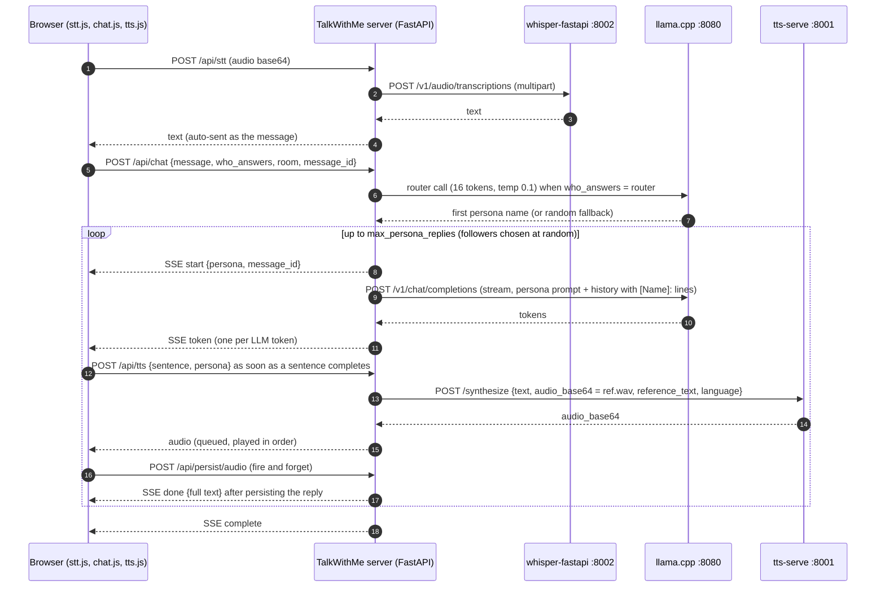

# Task 6 reconnaissance — the TalkWithMe tour (unit 1)

**Date:** 2026-09-21 (opened; living until Task 6 starts) ·
**Arc:** MVP prototype · **Branch:** `alfre2v/task6-recon-brief`
**Type:** guided code tour, unit 1 of the Task 6 reconnaissance
brief (umbrella: `docs/discussions/2026-09-21-task6-reconnaissance-brief.md`).
**Status:** section 1 written; sections 2–7 pending. Open questions
are marked OPEN.

*Context for the cold reader.* TalkWithMe is scorbo2's local
multi-persona chat application: a FastAPI server with a plain
JavaScript web UI, in which several AI "personas" (each with its
own system prompt and its own cloned voice) answer the user in a
shared chat room. We use it unmodified, at tag **7.1** (commit
`93df6ca`), as the front end and director of the Zombie-Radio
prototype: it runs on the Mac laptop, talks through an SSH tunnel
to three model services on a rented GPU box — llama.cpp on
port 8080 (the LLM), tts-serve on port 8001 (text-to-speech by
voice cloning), whisper-fastapi on port 8002 (speech-to-text) —
and drives a cast of four placeholder personas (Daniel, Moira,
Ralph, Samantha) whose reference voices were generated with the
Mac's `say` command. Task 6 will fork it to (a) remove the speaker
label the personas have started emitting and (b) replace the
per-sentence speech split with a pack-up-to-N-characters
accumulator. This tour reads the 7.1 code to find where those
patches go and what else the fork should know.

*All paths below are absolute paths into the owner's working
clone, `/Users/alfredo/workspace/hackTNT_2026/TalkWithMe/`, which
is byte-identical to the pristine installer clone
`/Users/alfredo/TalkWithMe-client/` (both at `93df6ca`). Labels:
measured = inspected in the code or run; docs-say = upstream's
own documentation; believed = inference.*

---

## 1. The pipeline map — microphone to speaker

### 1.1 A turn in one paragraph

The audience member presses the microphone button and speaks; the
browser records, sends the audio to the TalkWithMe server, which
forwards it to the Whisper service and puts the transcript into
the input box and sends it as a chat message. The server picks a
first persona (by asking the LLM, at random, or as named by the
user), then loops: for each of up to `max_persona_replies`
personas, it builds a prompt from that persona's system prompt and
the room history, streams the LLM's tokens to the browser, and
stores the finished reply in the room's history file. The browser
shows the tokens as they arrive and, in streaming-TTS mode, cuts
complete sentences out of the running text and sends each to the
server's TTS endpoint, which attaches the persona's reference clip
and transcript and calls tts-serve; the returned audio is queued
and played in order. All of this happens inside one HTTP request
per user message, using server-sent events (SSE).

### 1.2 The eight hops

1. **Microphone to text, in the browser.** The mic button toggles
   a `MediaRecorder`
   (`/Users/alfredo/workspace/hackTNT_2026/TalkWithMe/static/stt.js:9`);
   the keyboard shortcut Ctrl+Space does the same
   (`/Users/alfredo/workspace/hackTNT_2026/TalkWithMe/static/app.js:134`).
   When recording stops, the browser base64-encodes the blob and
   posts it to the app's own `/api/stt` endpoint (`stt.js:61`).
   The transcript that comes back is appended to the input box
   (`stt.js:78`), the recording is uploaded for persistence under
   a message UUID generated on the spot (`stt.js:85`–`90`), and
   the message is **sent automatically** (`stt.js:98`). So the
   microphone is push-to-talk with no end-of-utterance detection
   and no confirmation step: what Whisper heard is what gets sent.
   *Measured.*

2. **The STT proxy.** The server decodes the audio and forwards it
   as a multipart upload to the OpenAI-compatible transcription
   endpoint `/v1/audio/transcriptions` on the STT server
   (`/Users/alfredo/workspace/hackTNT_2026/TalkWithMe/app/services/stt_client.py:63`),
   with the timeout from settings (30 s in our seeded
   configuration). It returns text, language, and an optional
   language probability. Nothing else happens on this hop.
   *Measured.*

3. **Sending a message.** `sendMessage`
   (`/Users/alfredo/workspace/hackTNT_2026/TalkWithMe/static/chat.js:65`)
   posts `{message, who_answers, chat_room, message_id}` to
   `/api/chat` (`chat.js:119`–`128`) and then reads the response
   body as a hand-parsed stream of `data: {json}` lines
   (`chat.js:135`–`159`), dispatching each to `handleSSEEvent`.
   Two things happen before the post:
   - *Mention detection* (`chat.js:80`–`91`): if the text contains
     a persona's name as a whole word, the "selected persona"
     radio is switched to that persona, so `who_answers` becomes
     that name. Controlled by the setting
     `general.persona_name_mentions` (true in our seed).
   - *The who-answers radio* (`chat.js:53`–`59`): `router`,
     `random`, or `selected` (the sidebar persona, falling back
     to `router` if none is selected).
   Sending is blocked while a turn is streaming (`chat.js:67`,
   `109`): the audience cannot interrupt mid-turn. *Measured.*

4. **The reply loop, server side.** The endpoint is `POST /api/chat`
   (`/Users/alfredo/workspace/hackTNT_2026/TalkWithMe/app/routers/chat.py:344`),
   which returns a `StreamingResponse` driven by the generator
   `_chat_stream` (`chat.py:208`). In order:
   - switch the session to the requested room (`chat.py:211`);
   - resolve the personas eligible in that room from the chat-room
     config — the "default" room means all personas
     (`chat.py:215`, function `_resolve_room_personas` at
     `chat.py:32`–`55`);
   - `max_replies = min(settings.general.max_persona_replies,
     number of eligible personas)` (`chat.py:223`) — 4 in our
     seed;
   - pick the **first** speaker with `_pick_persona`
     (`chat.py:226`, function at `chat.py:98`–`133`): for
     `router`, it builds a small prompt listing the eligible
     personas with their "router hints" and the recent history
     (`_build_router_prompt`, `chat.py:62`–`95`) and asks the LLM
     for a name with a non-streaming call of at most 16 tokens at
     temperature 0.1 and a 15 s timeout
     (`/Users/alfredo/workspace/hackTNT_2026/TalkWithMe/app/services/llm.py:121`–`145`);
     any failure or an unknown name falls back to `random.choice`
     (`chat.py:122`–`125`);
   - persist the user message (`chat.py:232`);
   - check the room's echo-chamber flag (`chat.py:234`–`250`);
   - **loop over replies** (`chat.py:254`): reply 0 is the first
     speaker; every **follower** is `random.choice` of the eligible
     personas that have not yet replied (`chat.py:258`–`261`). Per
     reply: mint the assistant message UUID *before* anything is
     sent (`chat.py:284`), emit the SSE `start` event carrying
     persona name and both message IDs (`chat.py:289`), build the
     LLM messages (`chat.py:297`–`302`, see hop 5), stream tokens
     — appending each to `full_text` and emitting it as a `token`
     event in the same instant (`chat.py:328`–`330`; the tool-
     calling variant at `chat.py:305`–`321` does the same) —
     then persist the finished reply (`chat.py:337`) and emit
     `done` with the full text (`chat.py:339`). After the last
     reply, emit `complete` (`chat.py:341`).
   *Measured.*

5. **Context assembly.** `SessionManager.build_llm_messages`
   (`/Users/alfredo/workspace/hackTNT_2026/TalkWithMe/app/session.py:123`–`163`)
   builds the messages list for one persona's request:
   - a `system` message = the persona's system prompt, then the
     persona's saved memories if enabled, then the global system
     prompt (assembled at `chat.py:298`–`299` by
     `_system_prompt_with_memories`, `chat.py:140`–`180`, and
     `_with_global_system_prompt`, `chat.py:183`–`201`);
   - the last N history **entries** (`session.py:144`; N is
     `general.max_turns_for_context`, 50 in our seed), each
     rewritten for the responding persona: the human's lines keep
     role `user`; the persona's own earlier lines keep role
     `assistant`; **every other persona's line becomes a `user`
     message whose text is `[Name]: what they said`**
     (`session.py:156`–`161`). The code comment explains why: it
     avoids consecutive `assistant` messages (which many servers
     reject) and stops the model treating another persona's words
     as its own.
   The request payload for a persona reply carries only `model`,
   `messages`, `max_tokens`, `temperature`, and `stream: true`
   (`llm.py:69`–`78`); everything else is the LLM server's default.
   *Measured.*

6. **The SSE consumer and the speech split.** `handleSSEEvent`
   (`/Users/alfredo/workspace/hackTNT_2026/TalkWithMe/static/chat.js:175`–`289`):
   - on `start`: create or reuse the chat bubble, adopt the
     server-issued message ID (`chat.js:199`), and in streaming-TTS
     mode reset the sentence buffer (`chat.js:217`–`220`);
   - on `token`: append the token to the bubble (`chat.js:226`)
     and, if TTS is enabled and in streaming mode, hand it to
     `accumulateForTTS` (`chat.js:231`–`235`);
   - on `done`: flush whatever is left in the sentence buffer as
     one last synthesis request (`chat.js:249`–`256`), or in
     non-streaming mode enqueue the whole text at once
     (`chat.js:259`).
   In `/Users/alfredo/workspace/hackTNT_2026/TalkWithMe/static/tts.js`:
   `accumulateForTTS` (`tts.js:88`–`95`) appends the token to a
   buffer and calls `extractSentences` (`tts.js:72`–`83`), which
   applies the regular expression `/[^.!?]*[.!?]+/g` — "anything up
   to and including a run of `.`, `!` or `?`" — and enqueues each
   match immediately as one synthesis request. Two queues then run
   concurrently: `processTTSRequests` (`tts.js:111`–`129`) fetches
   **one request at a time, in order**; `processAudioBufferQueue`
   (`tts.js:136`–`150`) plays decoded buffers in order with an
   80 ms gap. Fetching sentence N+1 while sentence N plays is what
   gave the prototype its "almost natural" pauses. The non-
   streaming path (`enqueueTTS`, `tts.js:38`–`62`) fetches and
   plays serially with a 100 ms gap. *Measured.*

7. **The TTS proxy.** `POST /api/tts`
   (`/Users/alfredo/workspace/hackTNT_2026/TalkWithMe/app/routers/tts.py:100`–`150`)
   receives `{text, persona_name}`. It looks the persona up
   (`tts.py:107`–`110`); a persona is "TTS-capable" only if it has
   both a reference clip and a transcript
   (`/Users/alfredo/workspace/hackTNT_2026/TalkWithMe/app/config.py:287`–`289`);
   it refuses if the cached capabilities document says the engine
   cannot clone voices (`tts.py:122`–`131`); it **re-reads and
   base64-encodes `ref.wav` on every call** (`tts.py:134`, the
   function `encode_reference_audio` at
   `/Users/alfredo/workspace/hackTNT_2026/TalkWithMe/app/services/tts_client.py:615`–`626`)
   and reads `ref.txt` (`tts.py:135`); then calls `synthesize`
   (`tts_client.py:531`–`612`), which builds the JSON body from the
   engine's capabilities document — `text`, then `audio_base64`,
   `reference_text`, `language` if the engine advertises them,
   then every configured `tts.parameters` entry the engine
   advertises (`build_synthesis_payload`, `tts_client.py:452`–`510`)
   — posts it to `{tts.base_url}/synthesize` with the settings
   timeout (60 s in our seed), and on a 422 invalidates the
   capabilities cache, refetches, rebuilds, and retries exactly
   once (`tts_client.py:588`–`605`). The raw JSON reply is passed
   back; the browser reads only its `audio_base64` field
   (`tts.js:178`). *Measured.*

8. **The persistence side channel.** Each audio buffer the browser
   receives is uploaded for storage without waiting for the result
   (`tts.js:181`–`189`, via `uploadAudio` in
   `/Users/alfredo/workspace/hackTNT_2026/TalkWithMe/static/persistence.js:64`–`85`,
   endpoint `POST /api/persist/audio`). On the server
   (`/Users/alfredo/workspace/hackTNT_2026/TalkWithMe/app/persistence.py`),
   audio that arrives before its message row exists — the normal
   case in streaming mode, where sentences are synthesized while
   the reply is still being generated — is written under a
   `<id>_pending_<random>` filename and attached to the row when
   `persist_message` creates it (`persistence.py:41`–`53`, `202`).
   Rooms live under `chatrooms/<room>/history.json` plus the audio
   files. Personas live under `Personas/<Name>/` as `prompt.md`
   (YAML front matter with name, description, router hints, avatar
   color, tool flag, memory budget, followed by the system prompt
   body), `ref.wav`, `ref.txt`, optional `memories.txt` and an
   avatar image
   (`/Users/alfredo/workspace/hackTNT_2026/TalkWithMe/app/services/persona_store.py:9`–`15`
   and `49`–`53`). *Measured.*

### 1.3 The turn as a sequence diagram

### 1.4 Findings

#### F1 — Why personas speak their own name tag, and where a fix has to sit

*What we observe.* In the live show, a persona's reply starts with
`[Moira]:` and the TTS engine reads that tag aloud. Sometimes a
persona wears another persona's tag (the "cross-persona label
wearing" specimens on the watch list: Ralph under `[Daniel]:`, a
doubled `[Moira]:`).

*Why it happens.* TalkWithMe sends one LLM request per persona
reply. For Moira to know what Ralph and Daniel said, their lines
must appear in Moira's request. `build_llm_messages`
(`/Users/alfredo/workspace/hackTNT_2026/TalkWithMe/app/session.py:146`–`161`)
does this by rewriting history for the responding persona: the
human's lines keep role `user`; Moira's own earlier lines keep role
`assistant`; every other persona's line becomes a `user` message
whose text is `[Ralph]: what Ralph said` (`session.py:159`). So the
model sees a transcript in which almost every incoming line looks
like `[Name]: text`. A small model imitates the format it is shown
and opens its own answer with `[Moira]:`. That is the leak. It is
not a prompt bug and the Global System Prompt cannot fully
suppress it, because the pattern is present in every request by
construction. It also explains the cross-persona wearing: the model
copies a format, and sometimes copies the wrong name with it.
*Measured (the mechanism); believed (that imitation is the cause —
consistent with every specimen so far).*

*Consequence one.* The fix cannot be "remove the labels from the
context". Those labels are the only thing telling the model who
said what. The fix must remove the label from the persona's **own
output**, and leave the context labels alone.

*Where the output flows, and why placement matters.* In
`_chat_stream`
(`/Users/alfredo/workspace/hackTNT_2026/TalkWithMe/app/routers/chat.py:328`–`330`),
tokens arrive from the LLM one at a time; each is appended to
`full_text` and, in the same instant, sent to the browser as an
SSE `token` event. Only when the stream ends does the server
persist `full_text` (`chat.py:337`) and send `done` with the whole
text (`chat.py:339`). In the browser (`chat.js:223`–`237`), each
`token` event goes into the chat bubble and — because our settings
have streaming TTS on — into `accumulateForTTS`
(`/Users/alfredo/workspace/hackTNT_2026/TalkWithMe/static/tts.js:88`–`95`),
which cuts complete sentences out of the running token text and
sends each to `/api/tts` immediately, while the LLM is still
generating. So the first sentence, `[Moira]: We need to check the
generator.`, has been synthesized and is probably already playing
before the `done` event exists.

*Consequence two.* A sanitizer that strips the label at
`chat.py:337`, just before persisting, would clean the stored
transcript and therefore the context of every later reply — the
taxonomy C3 win we wanted. But the label would **still be spoken**,
because speech is cut from the token stream, not from the stored
text. To clean speech as well, the server has to filter tokens
*before* yielding them as SSE events. The label arrives split
across several tokens (something like `[`, `Mo`, `ira`, `]:`,
` We`), so the filter cannot judge one token at a time: it must
hold back the first few tokens of each reply until it can decide
whether they form a label, drop the label if so, then pass
everything else through unchanged. That is a **stream-head
filter**: a small state machine that runs only at the head of each
reply.

*Options (decision OPEN, see §1.7 Q1):*

1. **Server stream-head filter inside `_chat_stream`**
   (recommended). One place; cleans both the spoken stream and the
   stored transcript. Cost: it touches the SSE loop, and the first
   token reaches the browser a few tokens later than today.
2. **Server strip at persist time only.** Trivial; cleans the
   transcript; does nothing for speech. Not sufficient alone.
3. **Browser-side strip in `tts.js` before enqueue, plus option 2
   for the transcript.** Two patches in two languages for one
   defect; worse for upstreaming.

#### F2 — What happens when a reply hits the 200-token cap

*What is configured.* Our seeded `settings.yaml` sets
`llm.max_tokens: 200`. That number is copied into every persona
request
(`/Users/alfredo/workspace/hackTNT_2026/TalkWithMe/app/services/llm.py:75`).

*What happens at the cap.* When the model has not finished after
200 tokens, llama-server stops it wherever it is — often mid-
sentence — and marks the stream with finish reason `length`.
TalkWithMe does not look at that marker on the plain streaming
path: `stream_chat` (`llm.py:107`–`118`) reads only the token
text. The application therefore never knows a reply was cut.
*Measured.*

*Three consequences, one per hop:*

- **Stored transcript:** the truncated text is persisted as if
  complete (`chat.py:337`) and re-enters every later persona's
  context as `[Name]: …half a sent`. Fragments in context teach
  the model that fragments are acceptable output — a mild form of
  taxonomy C3 contamination.
- **Speech:** the tail of a reply with no terminal punctuation
  never matches the sentence regex, so it waits in the sentence
  buffer until `done`, where it is flushed to TTS as-is
  (`chat.js:249`–`256`). The audience hears a sentence that stops
  in mid-air.
- **Display:** the bubble shows the cut text with no marker.

*Why it matters.* Not a bug in TalkWithMe — it is the intended
contract. For a radio play it is a lever we control and should
decide on: `max_tokens` is effectively the line-length knob a
director would use for pacing, and a cut mid-sentence can sound
like a radio dropout — possibly even in-fiction — but it should be
a choice, not an accident. It is also a Task 5a consideration: the
models under audition differ in verbosity, so a fixed 200 will
truncate some and not others, and the truncation itself would
change the narrative-health scores.

#### F3 — The "1." echo artifact is the sentence splitter, confirmed

The regex `/[^.!?]*[.!?]+/g` (`tts.js:74`) treats any run of
`.`, `!`, `?` as a sentence end. A numbered list therefore yields
`1.` as a complete "sentence", and `Dr.` does the same. Each such
fragment becomes its own synthesis request — a cloned voice
pronouncing "one" or "doctor" in isolation, which is the echo-like
artifact heard from Moira. The accumulator's motivation is now a
receipt, not a suspicion. *Measured.*

#### F4 — The vanished sentence has a silent failure path

`fetchTTS` returns `null` on any non-OK HTTP status or when the
reply lacks `audio_base64` (`tts.js:172`–`178`), and the fetch loop
skips a `null` without retry and without any UI signal
(`tts.js:118`); the only trace is a `console.warn`. On the server
side, a synthesis timeout (60 s) or any exception makes
`synthesize` return `None` (`tts_client.py:606`–`612`) and the
router answers 502 (`tts.py:147`–`148`). When the item recurs, the
browser devtools console will show `TTS request failed: 502` (or
another status) and the Network tab the failing `/api/tts` call.
The 09-19 observation that the tts-serve log showed only 200s is
consistent with this only if the failure was on the client side or
the request to tts-serve never went out — which is where to look.
*Measured (the paths); believed (which one fired on 09-19).*

#### F5 — Every sentence ships the reference clip

Every `/api/tts` call re-reads `ref.wav` from disk, base64-encodes
it, and puts it in the request body (`tts.py:134`;
`tts_client.py:482`–`483`). In streaming mode that is one copy per
sentence. Measured on the four placeholder voices in
`/Users/alfredo/TalkWithMe-client/Personas/`:

| Persona | ref.wav size | duration | format |
|---|---|---|---|
| Daniel | 277,318 B | 5.7 s | 24 kHz, 16-bit mono |
| Moira | 246,042 B | 5.0 s | 24 kHz, 16-bit mono |
| Ralph | 246,580 B | 5.1 s | 24 kHz, 16-bit mono |
| Samantha | 290,450 B | 6.0 s | 24 kHz, 16-bit mono |

Base64 adds one third, so roughly 330–390 KB per sentence travels
over the SSH tunnel to the GPU box; real actor clips may be
longer. Whether tts-serve can cache references or address a voice
by identifier is seam question **S1** in the umbrella document.
*Measured.*

#### F6 — The context window counts entries, not user turns

N is a slice of the last N history messages (`session.py:144`),
and a history message is one persona reply or one user line. With
4 replies per user message, our N = 50 is about 10 user turns. The
router prompt uses the same slice (`chat.py:75`–`76`). Relevant to
Task 5a's "name-memory retest at the raised window": the window is
smaller in turns than the number suggests. *Measured.*

#### F7 — The 2026-09-18 audit anchors hold at 7.1

The four anchors from the earlier, unpinned source audit were
re-verified: the persona payload sends only `max_tokens` and
`temperature` besides model/messages/stream (`llm.py:69`–`78`);
the router call `chat_completion` runs at temperature 0.1 with
16 tokens (`llm.py:121`–`145`, called from `chat.py:117`);
`_pick_persona` routes only the first speaker (`chat.py:98`–`133`,
called at `chat.py:226`); followers are `random.choice`
(`chat.py:261`). *Measured.*

#### F8 — One user, one room, one turn at a time

The session is a process-wide singleton (`session.py:170`–`171`);
one room is current at a time; the SSE response keeps the HTTP
request open for all replies of a turn; and the browser refuses to
send while a turn streams (`chat.js:67`). For a radio show this
means the audience cannot interject during a multi-persona turn,
and a director loop will have to either live with that or change
the turn model. Noted for section 5. *Measured.*

### 1.5 Upstream vocabulary met in this section

Persona · chat room · echo chamber · who answers (modes `router`,
`random`, `selected`) · max persona replies · history entry ·
streaming TTS · capabilities document · message ID · staged
(pre-row) audio. Definitions in the umbrella document's glossary.

### 1.6 Reading itinerary for the owner (one sitting)

1. `/Users/alfredo/workspace/hackTNT_2026/TalkWithMe/static/chat.js:65`
   — `sendMessage`: what the browser owns before the server sees
   anything (mention detection, who-answers, the message UUID).
2. `/Users/alfredo/workspace/hackTNT_2026/TalkWithMe/app/routers/chat.py:208`
   — `_chat_stream`: the whole reply loop, top to bottom.
3. `/Users/alfredo/workspace/hackTNT_2026/TalkWithMe/app/session.py:123`
   — `build_llm_messages`: where the labels are born.
4. `/Users/alfredo/workspace/hackTNT_2026/TalkWithMe/static/chat.js:175`
   — `handleSSEEvent`: where speech is cut from live tokens.
5. `/Users/alfredo/workspace/hackTNT_2026/TalkWithMe/static/tts.js:72`
   to `150` — the splitter and the two queues.
6. `/Users/alfredo/workspace/hackTNT_2026/TalkWithMe/app/routers/tts.py:100`
   and `/Users/alfredo/workspace/hackTNT_2026/TalkWithMe/app/services/tts_client.py:531`
   — the synthesize contract as the client sees it.

Question to hold while reading: where would you cut so that both
the spoken stream and the stored transcript come out clean, with
one patch?

### 1.7 Open questions from section 1

- **Q1 — OPEN. Does the sanitizer become a stream-head filter?**
  It is a bigger patch than a regex at persist time and it touches
  the SSE loop (see F1, options 1–3). Agent's recommendation:
  option 1.
- **Q2 — OPEN. Which labels should it strip?** Only the persona's
  own name (`[Moira]:` when Moira speaks); any bracketed `[X]:`
  prefix (the cross-persona wearing specimens argue for this); or
  also a bare `Name:` without brackets, the 2024 wire format.
- **Q3 — OPEN, parked for section 5. Mention detection.** The
  browser overrides who-answers when the user names a persona
  (`chat.js:80`–`91`). In a radio show, should the audience saying
  "Moira" force Moira to answer? A director may want that power
  for itself.

---

## 2. The server-side reply path and the sanitizer insertion point

*Pending. Will detail the persistence and message model
(`ChatMessage`, `history.json`), the exact insertion point for the
stream-head filter, and the argument for server-side placement,
building on F1.*

## 3. The anatomy of `static/tts.js`

*Pending. Will detail the splitter and the two queues at function
level, where the vanished-sentence item is observable (F4), and
where a maximum-characters knob enters the accumulate/enqueue
path.*

## 4. Settings plumbing

*Pending. How a knob travels `settings.yaml` → `app/config.py` →
`app/routers/settings.py` → `static/settings.js` /
`static/gen-settings.js`, so the accumulator's N and a sanitizer
toggle land as proper settings.*

## 5. Seams for the narration future

*Pending. Router and follower code, room and turn model (F8),
mapped against spec §5.3's four open questions and the 2024
baseline (umbrella document §7). Maps only, designs nothing.*

## 6. Upstreamability audit

*Pending. Two separable commits off tag 7.1; upstream's `AGENTS.md`
(45 KB) and pytest conventions as house-style receipts; test
posture per patch; alignment with [discussion 2026-09-19] §4.*

## 7. Explicitly out

No fork is created, no patch code is written, and no director is
designed in this tour.

## 8. Update trail

- **2026-09-21** — Document created. Section 1 (pipeline map,
  eight hops, sequence diagram, findings F1–F8, vocabulary,
  itinerary, open questions Q1–Q3) written after the section-1
  conversation, at conversation-level detail (owner rule).
